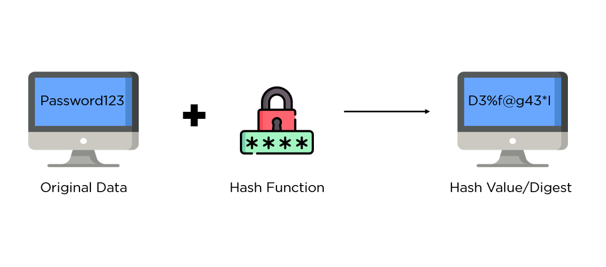
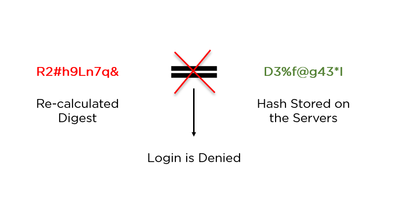
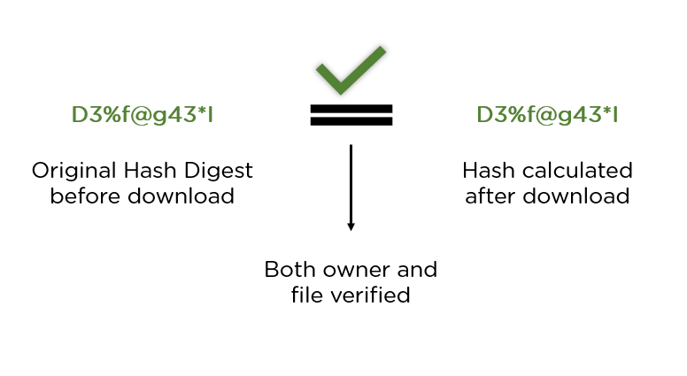

# Hashing-101

Hashing is the process of scrambling raw information to the extent that it cannot be reversed to its original form. It takes a piece of information and passes it through a function that performs mathematical operations on the plaintext. This function is called the hash function, and the output is known as the hash value or digest.

  

As depicted in the image above, the hash function is responsible for converting plaintext into its respective hash digest. These digests are designed to be irreversible, meaning they should not provide you with the original plaintext through any means.

Hash functions also ensure consistency, meaning they produce the same output value if the input remains unchanged, regardless of the number of iterations.

## Primary Applications of Hashing

### 1. Password Hashes

In most website servers, user passwords are converted into hash values before being stored on the server. During login, the server recalculates the hash value and compares it to the one stored in the database for validation.

  

### 2. Integrity Verification

When a file is uploaded to a website, its hash is often shared alongside it. When a user downloads the file, they can recalculate the hash and compare it to ensure data integrity.

  

## About This Repository

This repository provides an overview of different hashing techniques used in various applications. Hashing is a fundamental concept in computer science, cryptography, and data processing. Here, we'll explore some of the most common hashing algorithms and their key details.

## Hashing Techniques

### 1. SHA-3 (Secure Hash Algorithm 3)

- Description: SHA-3 is one of the most secure hashing algorithms available and is resistant to various types of attacks. It's suitable for cryptographic purposes.
- Usage: Cryptography, data integrity verification.

### 2. Argon2

- Description: Argon2 is designed for password hashing and is highly secure. It's resistant to GPU and ASIC attacks, making it ideal for secure password storage.
- Usage: Secure password hashing.

### 3. bcrypt

- Description: bcrypt is a secure password-hashing algorithm that incorporates a "work factor" to slow down brute-force attacks. It's widely used for password security.
- Usage: Secure password hashing.

### 4. scrypt

- Description: scrypt is similar to bcrypt and is designed for secure password hashing. It's resistant to brute-force attacks, making it suitable for safeguarding user credentials.
- Usage: Secure password hashing.

### 5. Blake2

- Description: Blake2 is a high-speed cryptographic hash function known for its security and efficiency. It's suitable for various applications.
- Usage: Cryptography, checksums, data integrity verification.

### 6. SHA-256 (Secure Hash Algorithm 256-bit)

- Description: SHA-256 is a widely used hashing algorithm that provides a high level of security. It's suitable for general cryptographic purposes.
- Usage: Cryptography, data integrity verification.

### 7. Whirlpool

- Description: Whirlpool is a cryptographic hash function known for its strong security profile. It provides a high level of security for various applications.
- Usage: Cryptography, data integrity verification.

### 8. SHA-1 (Secure Hash Algorithm 1)

- Description: SHA-1 is deprecated for most cryptographic uses due to vulnerabilities, but it still has some security for non-cryptographic applications.
- Usage: Legacy non-cryptographic applications.

### 9. MD5 (Message Digest 5)

- Description: MD5 is widely considered insecure for cryptographic purposes due to vulnerabilities and collisions.
- Usage: Legacy non-cryptographic applications.

### 10. CRC32 (Cyclic Redundancy Check)

- Description: CRC32 is not designed for cryptographic security and should only be used for error-checking in data storage and transmission.
- Usage: Data integrity verification in non-cryptographic applications.

## Contribution

Feel free to contribute to this repository by adding more hashing techniques, code examples, or explanations for each technique. Your contributions will help others learn and understand different hashing methods and their use cases.

## License

This repository is open-source and available under the [MIT License](LICENSE). You are encouraged to use, modify, and distribute the content in compliance with the license terms.

Don't forget to give this repository a star if you find it useful!

Happy hashing!

[//]: # (hashing-101/  &#40;Folder&#41;)

[//]: # (|-- README.md  &#40;File&#41;)

[//]: # (|-- requirements.txt  &#40;File&#41;)

[//]: # (|-- examples/  &#40;Folder&#41;)

[//]: # (|   |-- example1.py  &#40;File&#41;)

[//]: # (|   |-- example2.py  &#40;File&#41;)

[//]: # (|   |-- ...  &#40;Other example files&#41;)

[//]: # (|-- src/  &#40;Folder&#41;)

[//]: # (|   |-- hash_algorithms/  &#40;Package&#41;)

[//]: # (|   |   |-- md5.py  &#40;File&#41;)

[//]: # (|   |   |-- sha1.py  &#40;File&#41;)

[//]: # (|   |   |-- sha256.py  &#40;File&#41;)

[//]: # (|   |   |-- ...  &#40;Other algorithm files&#41;)

[//]: # (|   |-- utils/  &#40;Package&#41;)

[//]: # (|   |   |-- validation.py  &#40;File&#41;)

[//]: # (|   |-- hashing.py  &#40;File&#41;)

[//]: # (|-- tests/  &#40;Folder&#41;)

[//]: # (|   |-- test_md5.py  &#40;File&#41;)

[//]: # (|   |-- test_sha1.py  &#40;File&#41;)

[//]: # (|   |-- test_sha256.py  &#40;File&#41;)

[//]: # (|   |-- ...  &#40;Other test files&#41;)

[//]: # (|-- docs/  &#40;Folder&#41;)

[//]: # (|   |-- algorithm1.md  &#40;File&#41;)

[//]: # (|   |-- algorithm2.md  &#40;File&#41;)

[//]: # (|   |-- ...  &#40;Other algorithm documentation files&#41;)
