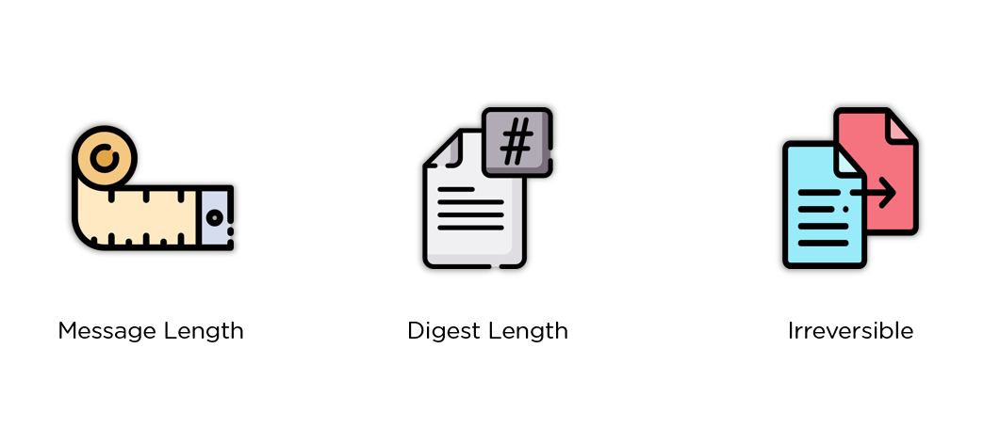
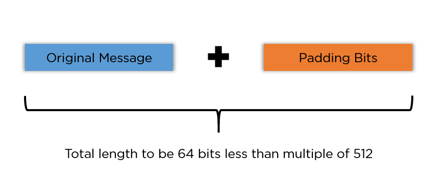
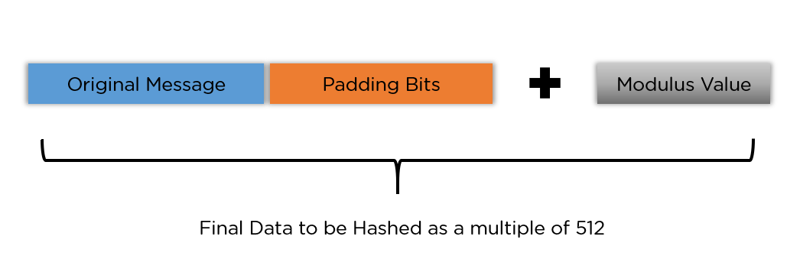
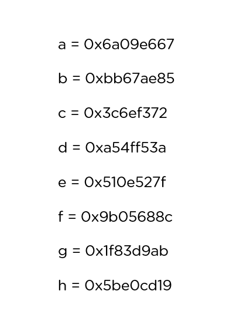
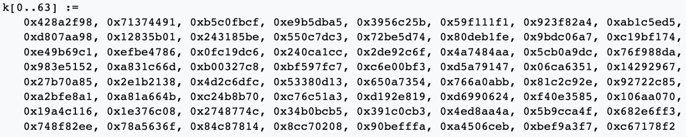
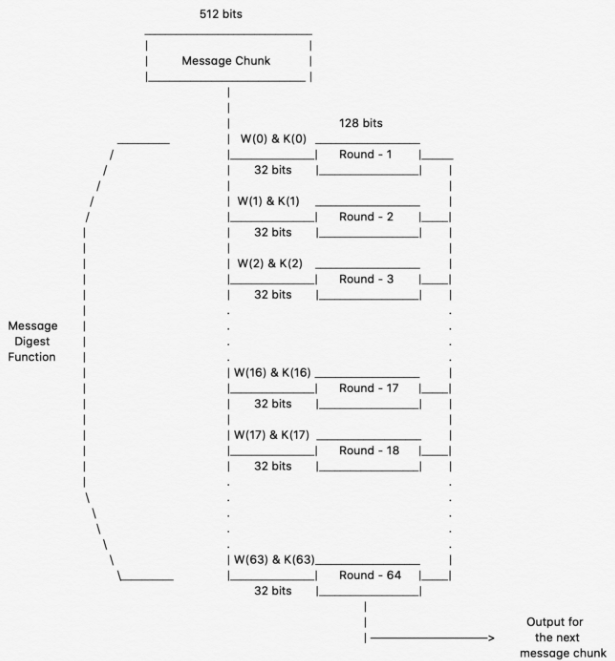
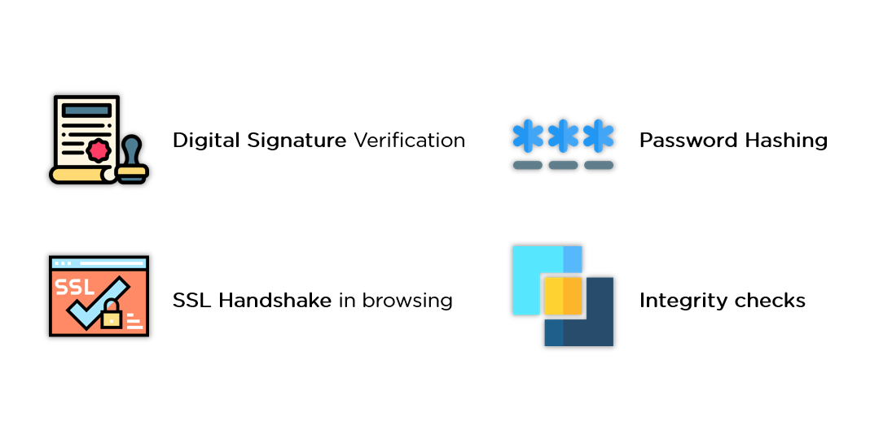

# SHA-256: Safeguarding Your Data

SHA-256 is a part of the Secure Hash Algorithm 2 (SHA-2) family, designed to keep your data secure. Developed in 2001 through a collaboration between the NSA and NIST, SHA-256 was created to replace its vulnerable predecessor, SHA-1, which was at risk from brute force attacks. The "256" in SHA-256 denotes the fixed length of its digital fingerprint, which is always 256 bits.

Our journey through this cybersecurity boot camp will help you understand the inner workings of technologies like SHA-256. You'll uncover the cryptographic principles behind this algorithm, making it a vital component of blockchain security. As you progress, you'll also enhance your ability to defend against cyber threats.

## Exploring SHA-256 Characteristics

  

**Message Length:** The original message (cleartext) should be shorter than 264 bits. Keeping the cleartext within this size range contributes to a more secure digital fingerprint.

**Digest Length:** SHA-256 produces a digital fingerprint of 256 bits. In comparison, SHA-512, another member of the SHA-2 family, generates a larger 512-bit digital fingerprint. Larger digital fingerprints require more computational resources, which can impact processing speed and storage.

**Irreversible:** SHA-256, like other hash functions, is irreversible. This means you cannot retrieve the original cleartext from its digital fingerprint, nor can the digital fingerprint reveal its original content when hashed again.

## Understanding the Five Steps of SHA-256 Algorithm

### Step 1: Padding Bits

  

In this step, extra bits are added to the message to ensure the total length is just 64 bits short of a multiple of 512. The first bit is set to one, and the rest are filled with zeroes.

### Step 2: Padding Length

  

Next, 64 bits of data are added to make the final plaintext a multiple of 512. These 64 bits are calculated using a mathematical operation applied to the original cleartext without the padding.

### Step 3: Initializing the Buffers

  

Eight default buffers are initialized for use in the rounds. Additionally, an array of 64 different keys, ranging from K[0] to K[63], is initialized.

### Step 4: Compression Functions

  

The entire message is divided into blocks of 512 bits each, and each block undergoes 64 rounds of operations. The output of each block serves as the input for the following block. The value of K[i] is pre-set in each round, while W[i] is individually calculated for each block, depending on the number of iterations at that moment.

### Step 5: Output

  

With each iteration, the final output of the block becomes the input for the next block. This process repeats until the last 512-bit block is reached, and the output from that block becomes the final digital fingerprint. This digital fingerprint is always 256 bits in length, as indicated by the name of the algorithm.

## Real-World Applications of SHA-256

  

SHA-256 plays a crucial role in various real-world applications:

- **Digital Signature Verification:** Digital signatures use SHA-256 to ensure the authenticity of documents or files. This hashing algorithm is instrumental in verifying the signature's validity.

- **Password Security:** Websites often store user passwords in a hashed format to enhance privacy and reduce the load on central databases. SHA-256 helps maintain the security and integrity of stored passwords.

- **Secure Browsing (SSL Handshake):** The SSL handshake, a critical component of web browsing sessions, relies on SHA functions to establish secure connections. Your web browser and the web server agree on encryption keys and use hashing to authenticate and create secure connections.

- **Data Integrity Verification:** SHA-256, along with other hashing algorithms, is used to verify the integrity of files. This ensures that files remain unaltered during transmission, maintaining their integrity and value.

## Bibliography

1. [Secure Hash Standard (SHS)](https://nvlpubs.nist.gov/nistpubs/FIPS/NIST.FIPS.180-4.pdf). (2002, February 28). NIST.
2. [SHA-2 (Wikipedia)](https://en.wikipedia.org/wiki/SHA-2)
3. [Breaking Down SHA-256 Algorithm](https://infosecwriteups.com/breaking-down-sha-256-algorithm-2ce61d86f7a3). Medium Article.
4. [SHA-256 Algorithm](https://www.simplilearn.com/tutorials/cyber-security-tutorial/sha-256-algorithm). Simplilearn Article.
